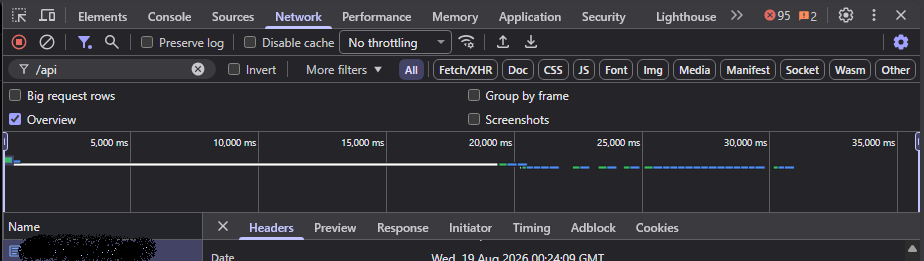

# Discord Message Deleter — delete your DM & channel messages

Bulk-delete **your own** messages in any Discord **DM, group, or channel**. Adds a small trash icon top-right — click it, panel pops up (draggable, resizable). Auto-detects whatever chat you have open. Only your messages get deleted. Works via Tampermonkey.

## ⚠️ Never share your token
Your token = full login to your account. No password, no 2FA needed. **Never** paste it in sites, bots, screenshots, or chats. Leaked it? → **Settings → My Account → Change Password**.

## Install
1. Get [Tampermonkey](https://www.tampermonkey.net/).
2. **[Install from Greasy Fork](https://greasyfork.org/en/scripts/591955-discord-message-deleter-dm-channel-cleaner)** — click "Install this script" and Tampermonkey does the rest.
3. **Enable user scripts in your browser** (one-time, required):
   - Chrome / Brave / Edge: `chrome://extensions` (Brave: `brave://extensions`) → turn on **Developer mode** (top-right) → click **Details** on Tampermonkey → enable **Allow User Scripts**.
   - If Tampermonkey shows a "Please enable Allow User Scripts" banner, that's this step.
4. Reload Discord in your browser. A small trash icon appears in the top-right corner.

## Get your token
`F12` → **Network** tab → type `/api` → click any row.

**Headers → Request Headers → authorization** → copy the value.

Paste it in the panel.

## Run
1. Click the trash icon (top-right) to open the panel. Drag by the header, resize from the bottom-right corner.
2. Open the chat you want cleared — the **Target** line auto-detects (takes 1–2 seconds after switching).
3. Paste your token → pick speed → **Start**.

Deletes only your messages, current chat only. Big histories take a while (Discord caps ~1/sec). Hit **Stop** any time. Click **−** to minimise back to the icon.

## Notes
- Web browser only (Chrome / Brave / Edge / Firefox). Tampermonkey cannot run inside the Discord desktop app.
- Position, size, and open/closed state are remembered per browser.

Self-botting breaks Discord ToS — use at your own risk. MIT.
